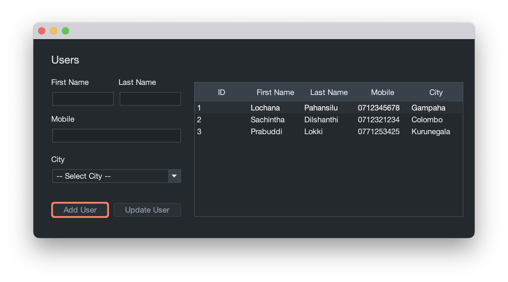

# Java-Kuppiya-01 | SAD

Let's Get Started with this _Software Application Development Kuppiya_ by **_Fork_** this Repo.

_From the `.jar` files which I have provided in `src/lib/` we are good to go with this simple project_

***

### Creating DataBase

Use this sqlfile as a reference sample database.

***

### DataBase Connectivity

First we Created the Java MySQL Database Connection File as, `Model/MySQL.java`.
Create a java class with the name of `MySQL.java`.
Make sure to rename database name, username and password to ensure the database connnected is success.

Then we have to import some classes/dependencies from our libraries to our project. 


```java

import java.sql.Connection;
import java.sql.DriverManager;
import java.sql.ResultSet;
import java.sql.Statement;

```

Then we have to create a public `Connection` object from the type of `Connection`.
inside the `public class MySQL {}`

```java

private static Connection connection;

```

After that, let's create a static object and obtain MySQL jdbc (Java DataBase Connectivity) Driver & construct and Inisialize the database connection.
For this we have to a `try{} catch(){}` for Exception handilng.

```java

static {

    try {
        Class.forName("com.mysql.cj.jdbc.Driver");
        connection = DriverManager.getConnection("jdbc:mysql://localhost:3306/exam", "root", "Upek@2004");
    } catch (Exception e) {
        e.printStackTrace();
    }

}

```

Now let's create a public static object to execute MySQL queries.
For this we also can use a `try{} catch(){}` for Exception handilng, but for the moment we can just throw any Exceptions in-order-to catch it from a place which we request the sql query.

```java

public static ResultSet execute(String query) throws Exception {

    Statement statement = connection.createStatement();

    if (query.startsWith("SELECT")) {
        return statement.executeQuery(query);
    } else {
        statement.executeUpdate(query);
        return null;
    }

}

```

When we considering the basic programming operations like `INSERT`, `UPDATE`, `DELETE`, `SEARCH` also simply refered as `CRUD` (Create, Read, Update, Delete) operations,
its basically can separate into two, based on the result (response) we get, which means most of the time op. like `INSERT`, `UPDATE`, `DELETE` are not giving us a result to handle
while the `SEARCH` are born for give us the result.

As well as In the above case I separated the query execution by looking at the starting text which we obtain by the String params from `execute(String query)`,
If a query which starts from `"SELECT"`, will automatically pars into the if condition by returning the query execution result while else retuns a null by updating the execution.

***

### Starting Development with `Home.java`

For the project I designed the GUI with Apache NetBeans IDE.
And also setup it with _FlatGitHubDarkIJTheme_ in order to improve my GUI's look and feel by importing from FlatLaf lib as follows,

import at the very top of the code base

```java

import com.formdev.flatlaf.intellijthemes.materialthemeuilite.FlatGitHubDarkIJTheme;
```

then setup inside the main class

```java

FlatGitHubDarkIJTheme.setup();
```

</br>

So heres how my `Home.java` GUI looks like,



Now import the relavant libraries & packages or classes from the libs.

```java

import Model.MySQL;
import com.formdev.flatlaf.intellijthemes.materialthemeuilite.FlatGitHubDarkIJTheme;
import com.formdev.flatlaf.themes.FlatMacDarkLaf;
import java.sql.ResultSet;
import java.util.Vector;
import javax.swing.DefaultComboBoxModel;
import javax.swing.table.DefaultTableModel;

```

to be continued...